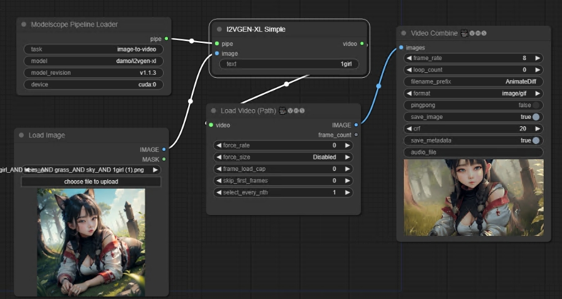

# This is an implementation of i2vgen-xl

[i2vgen-xl](https://github.com/ali-vilab/i2vgen-xl)

## Install

1. Clone this repo into custom_nodes directory of ComfyUI location

2. Run pip install -r requirements.txt

How to fix problems:

1. ValueError: attempted relative import beyond top-level package

Delete all content in file '~/.cache/modelscope/hub/damo/i2vgen-xl/tools/__init__.py'
Delete all content in file '~/.cache/modelscope/hub/damo/i2vgen-xl/tools/modules/__init__.py'

2. CUDA out of memory

Edit '~/.cache/modelscope/hub/damo/i2vgen-xl/ms_wrapper.py'

change `self.model.to(gpu)` to `self.model.half().to(gpu)`

## Examples

1. base workflow

https://github.com/chaojie/ComfyUI-I2VGEN-XL/blob/main/workflow.json
